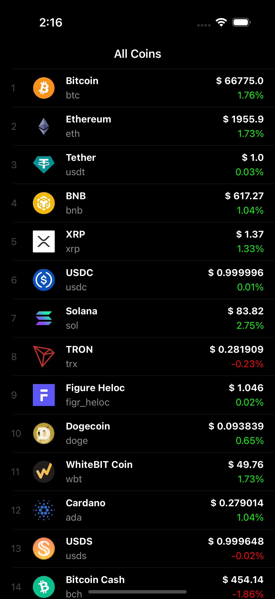
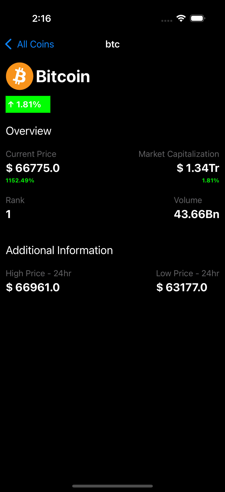

# Cryptonix

**Cryptonix** is a modern iOS application built in **Swift** that provides a clean and insightful experience for tracking cryptocurrency markets.  
Designed with **scalability, testability, and maintainability** in mind, the app delivers real-time prices, and detailed coin metadata through a responsive and intuitive user interface.

Whether you are a casual crypto enthusiast or an experienced trader, Cryptonix offers a reliable way to explore market data while showcasing strong iOS architectural practices.

---

## 📱 App Overview

Cryptonix allows users to browse a comprehensive list of cryptocurrencies, view real-time pricing information, and explore detailed information for individual assets.  
The project emphasizes **separation of concerns**, **modern Swift patterns**, and **developer-friendly tooling**.

---

## ✨ Key Features

- 📊 **Comprehensive Coin Listing**  
  Browse hundreds of cryptocurrencies with live price, market cap, and 24-hour change.

- 🔍 **Detailed Asset View**  
  Inspect individual coins with Rank, Market Capitalization, and Volumne.


- 🧩 **Modular & Scalable Design**  
  Clear separation between networking, models, services, and UI layers.


- ⚡ **Modern Swift Practices**  
  Built using structs, protocols, extensions, and clean abstractions for clarity and reuse.

---

## Screenshots

<table align="center">
  <tr>
    <td align="center">
      <br/>
      <b>Coin List</b>
    </td>
    <td align="center">
      <br/>
      <b>Coin Detail</b>
    </td>
  </tr>
  
</table>

## 🏗️ Architecture Highlights

- Service-driven data layer with real and mock implementations  
- Protocol-oriented design for flexibility and testability  
- Centralized networking layer using `URLSession`  
- Reusable UI components for consistency and maintainability  

---

## 📁 Project Structure

```text
Cryptonix/
├── Crypto/                     # Core domain logic
│   ├── Constants/              # App-wide constants & helpers
│   │   ├── APIKey.swift
│   │   └── Extension.swift
│   ├── MockData/               # Stubbed JSON & generators
│   │   └── MockData.swift
│   ├── Model/                  # Data models (e.g. Coin)
│   ├── Networking/             # API endpoints & URLSession wrappers
│   └── Service/                # Data services (real & mock)
│       └── MockCoinDataService.swift
│
├── ViewControllers/            # Screen-level controllers
│   ├── CoinPricesViewController.swift
│   └── CoinDetailViewController.swift
│
├── Views/                      # Reusable UI components
│   └── CoinTableViewCell.swift
│
├── AppDelegate.swift           # App lifecycle management
├── SceneDelegate.swift         # Scene handling (iOS 13+)
├── ViewController.swift        # Initial setup / entry logic
└── Info.plist                  # App configuration


## Tech Stack & Requirements

- Language: Swift 5.3+

- UI Framework: UIKit

- Networking: URLSession

- Architecture: Modular / Service-oriented

- Minimum iOS Version: iOS 14.0+

- Xcode: 12+ (13 recommended)
